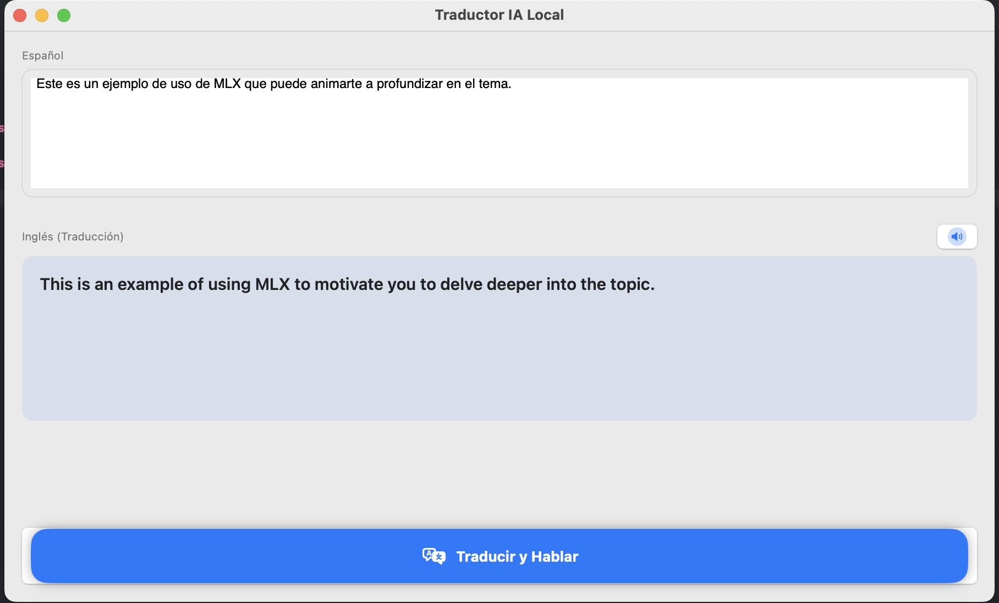
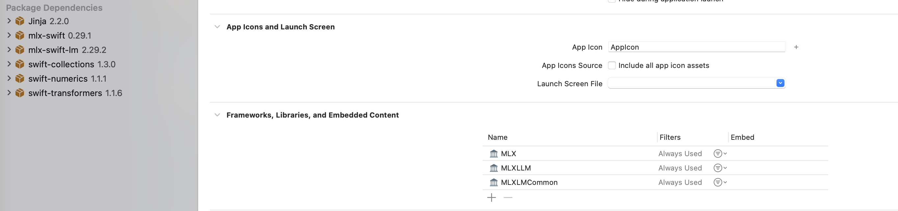

# TalkefcMLX: Traductor IA Local con MLX Swift

Ejemplo de implementación de **MLX de Apple** para la inferencia local de Modelos de Lenguaje (LLMs) en dispositivos con Apple Silicon.

Este proyecto es una referencia técnica diseñada para desarrolladores interesados en el despliegue de IA generativa de forma nativa. Demuestra cómo integrar modelos locales con una interfaz fluida en SwiftUI y un sistema de síntesis de voz optimizado para evitar bloqueos y warnings de concurrencia.

## Índice
1. [Objetivo](#objetivo)
2. [¿Qué es MLX y ventajas?](#qué-es-mlx-y-ventajas)
3. [Plataformas soportadas](#plataformas-soportadas)
4. [Dependencias (Packages)](#dependencias-packages)
5. [Estructura del Código](#estructura-del-código)
    * [Utilities (Audio Manager)](#utilities)
    * [View (SwiftUI)](#view)
    * [Translate (Inferencia de IA)](#translate)

---

## Objetivo
El propósito es proporcionar una base funcional sobre el uso de **MLX Swift**, demostrando la carga de modelos cuantizados (4-bit), la gestión de memoria unificada y un flujo de traducción con salida de voz (TTS) que cumple con los estándares de seguridad de hilos de **Swift 6**.

## ¿Qué es MLX y ventajas?
**MLX** es un framework de arrays diseñado por Apple para la investigación de aprendizaje automático en chips **Apple Silicon**.

**Ventajas clave:**
* **Privacidad (On-Device):** El procesamiento es local; los datos nunca abandonan el iPhone o Mac.
* **Eficiencia de Memoria:** Acceso directo a la memoria unificada, eliminando copias costosas entre CPU y GPU.
* **Sin Costes de API:** Ejecución gratuita sin suscripciones externas ni pagos por tokens.
* **Latencia:** Inferencia inmediata sin dependencia de conexión a internet.

## Plataformas soportadas
* **iOS / iPhone:** Optimizado para dispositivos con chip A15 Bionic o superior.
* **Mac:** Compatible con cualquier equipo con procesador Apple Silicon (M1, M2, M3).

## Dependencias (Packages)
Importar mediante Swift Package Manager (SPM):

* **MLX Swift:** El núcleo del framework.
  `https://github.com/ml-explore/mlx-swift`
* **MLX Swift Chat:** Librería de alto nivel para generación de texto.
  `https://github.com/ml-explore/mlx-swift-chat`

## Estructura del Código

### Utilities
* **SpeechManager:** Clase final marcada como `@unchecked Sendable` para gestionar `AVSpeechSynthesizer`.
    * Utiliza una **DispatchQueue** serie con `qos: .background` para delegar el procesamiento de audio fuera del hilo principal, eliminando avisos de *Priority Inversion*.
    * El método `toTalk(texto:)` filtra voces británicas mejoradas (`en-GB`) de alta calidad.
    * Gestiona la interrupción inmediata de la voz si se solicita una nueva traducción.

### View
Interfaz reactiva construida en **SwiftUI**:
* **Input:** `TextEditor` para la captura de texto en español.
* **Gestión de Carga:** Estados diferenciados `isLoading` e `isDownloading` para mostrar el progreso de descarga de pesos del modelo de forma precisa.
* **Scroll Nativo:** Uso de `ScrollView` para evitar el truncado de respuestas largas, permitiendo la lectura completa de traducciones y notas del modelo.

### Translate
Lógica principal en la clase **TranslaterManager** (`@Observable` y `@MainActor`):
* **Modelos Disponibles:** Selección dinámica entre `Llama 3.2 1B`, `Qwen 2.5 1.5B` y `Mistral 7B` a través de `TypeModelOption`.
* **Prompt Engineering:**
    * Implementación de **System Prompts** para definir el rol de traductor profesional.
    * Uso de **Few-Shot Prompting** (ejemplos Usuario/Asistente) para estabilizar el comportamiento de modelos pequeños y evitar que deriven a modo conversacional.
* **Configuración de Generación:**
    * `temperature: 0.0` para garantizar traducciones deterministas y precisas.
    * `repetitionPenalty: 1.1` para mejorar la fluidez del texto generado.
    * Actualización de `englishText` mediante streaming de tokens.

---
*Este proyecto es un ejemplo educativo. Se recomienda el uso de modelos de 1B o 1.5B para dispositivos iOS con limitaciones de RAM.*
